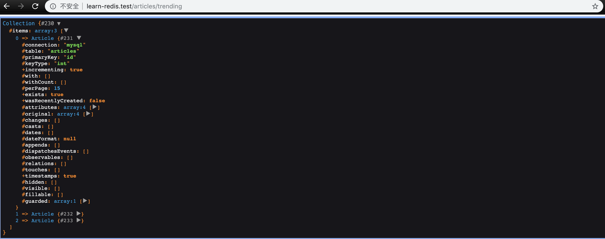

### 本节说明

* 对应第 3 小节：Trending Articles with Sorted Sets

### 本节内容

`Redis` 支持五种数据类型：string（字符串），hash（哈希），list（列表），set（集合）及zset(sorted set：有序集合)。

本节我们来学习 `zset（有序集合）`。`zset` 和 `set` 一样，都是 `string` 类型元素的集合,且不允许重复的成员。不同的是，`zset` 每个元素都会关联一个 `double` 类型的`score`，`Redis` 通过分数来为集合中的成员进行从小到大的排序。`zset` 的成员是唯一的，但 `score` 却可以重复。

下表列出来 `zset` 的常用命令：

| 序号 | 命令及描述 |
| ------ | ------ |
| 1 | ZADD key score1 member1 [score2 member2] 向有序集合添加一个或多个成员，或者更新已存在成员的分数 | 
| 2 | ZCARD key 获取有序集合的成员数
| 3	 | ZCOUNT key min max 计算在有序集合中指定区间分数的成员数
| 4	 | ZINCRBY key increment member 有序集合中对指定成员的分数加上增量 increment
| 5	 | ZINTERSTORE destination numkeys key [key ...] 计算给定的一个或多个有序集的交集并将结果集存储在新的有序集合 key 中
| 6	 | ZLEXCOUNT key min max 在有序集合中计算指定字典区间内成员数量
| 7	 | ZRANGE key start stop [WITHSCORES] 通过索引区间返回有序集合成指定区间内的成员
| 8	 | ZRANGEBYLEX key min max [LIMIT offset count] 通过字典区间返回有序集合的成员
| 9	 | ZRANGEBYSCORE key min max [WITHSCORES] [LIMIT] 通过分数返回有序集合指定区间内的成员
| 10 | 	ZRANK key member 返回有序集合中指定成员的索引
| 11 | 	ZREM key member [member ...] 移除有序集合中的一个或多个成员
| 12 | 	ZREMRANGEBYLEX key min max 移除有序集合中给定的字典区间的所有成员
| 13 | 	ZREMRANGEBYRANK key start stop 移除有序集合中给定的排名区间的所有成员
| 14 | 	ZREMRANGEBYSCORE key min max 移除有序集合中给定的分数区间的所有成员
| 15 | 	ZREVRANGE key start stop [WITHSCORES] 返回有序集中指定区间内的成员，通过索引，分数从高到底
| 16 | 	ZREVRANGEBYSCORE key max min [WITHSCORES] 返回有序集中指定分数区间内的成员，分数从高到低排序
| 17 | 	ZREVRANK key member 返回有序集合中指定成员的排名，有序集成员按分数值递减(从大到小)排序
| 18 | 	ZSCORE key member 返回有序集中，成员的分数值
| 19 | 	ZUNIONSTORE destination numkeys key [key ...] 计算给定的一个或多个有序集的并集，并存储在新的 key 中

我们先在命令行进行尝试：

```
redis-cli
```

我们来储存 `article` 的浏览趋势：

```
127.0.0.1:6379> ZADD trending_articles 5 learn-php
(integer) 1
127.0.0.1:6379> ZADD trending_articles 1 learn-redis
(integer) 1
127.0.0.1:6379> ZADD trending_articles 10 learn-html
(integer) 1
```

然后来获取集合的值：

```
127.0.0.1:6379> ZRANGE trending_articles 0 2
1) "learn-redis"
2) "learn-php"
3) "learn-html"
127.0.0.1:6379> ZRANGE trending_articles 0 2 WITHSCORES
1) "learn-redis"
2) "1"
3) "learn-php"
4) "5"
5) "learn-html"
6) "10"
127.0.0.1:6379> ZRANGE trending_articles 0 -1 WITHSCORES
1) "learn-redis"
2) "1"
3) "learn-php"
4) "5"
5) "learn-html"
6) "10"
127.0.0.1:6379> ZREVRANGE trending_articles 0 2 WITHSCORES
1) "learn-html"
2) "10"
3) "learn-php"
4) "5"
5) "learn-redis"
6) "1"
```

接下来我们应用在代码中。首先准备模型、迁移和模型工厂等文件：

*app/Article.php*

```
<?php

namespace App;

use Illuminate\Database\Eloquent\Model;

class Article extends Model
{
    //
}
```

*database/migrations/{timestamp}_create_articles_table.php*

```
<?php

use Illuminate\Support\Facades\Schema;
use Illuminate\Database\Schema\Blueprint;
use Illuminate\Database\Migrations\Migration;

class CreateArticlesTable extends Migration
{
    /**
     * Run the migrations.
     *
     * @return void
     */
    public function up()
    {
        Schema::create('articles', function (Blueprint $table) {
            $table->bigIncrements('id');
            $table->string('title');
            $table->timestamps();
        });
    }

    /**
     * Reverse the migrations.
     *
     * @return void
     */
    public function down()
    {
        Schema::dropIfExists('articles');
    }
}
```

*database/factories/ArticleFactory.php*

```
<?php

/** @var \Illuminate\Database\Eloquent\Factory $factory */
use App\Article;
use Illuminate\Support\Str;
use Faker\Generator as Faker;

/*
|--------------------------------------------------------------------------
| Model Factories
|--------------------------------------------------------------------------
|
| This directory should contain each of the model factory definitions for
| your application. Factories provide a convenient way to generate new
| model instances for testing / seeding your application's database.
|
*/

$factory->define(Article::class, function (Faker $faker) {
    return [
        'title' => $faker->sentence
    ];
});

```

然后生成一些数据：

```
php artisan tinker
>>> factory('App\Article',20)->create();
```

然后我们在浏览文章详情时，在 `Redis` 中记录下浏览数：

*routes/web.php*

```
<?phpga

Route::get('/articles/trending',function () {
    $trendingAtricles = Redis::zrevrange('trending_articles',0,2);

    $trendingAtricles = \App\Article::hydrate(
        array_map('json_decode',$trendingAtricles)
    );

    dd($trendingAtricles);
});

Route::get('/articles/{id}',function ($id) {

    $article = \App\Article::find($id);

    Redis::zincrBy('trending_articles',1,$article);

    dd($article);
});
```

>顺便问下，你知道为什么 `/articles/trending` 路由在前面吗？

在存入 `Redis` 时，`Laravel` 会自动将模型进行序列化；在`/articles/trending` 路由中，我们会取出 `score` 最高的三个 `article`：



