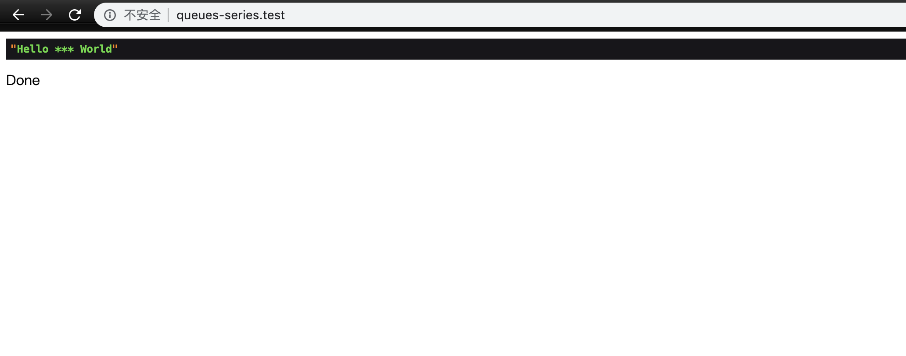

### 本节说明

* 对应第 9 小节：Take a Ride on the Laravel Pipeline

### 本节内容

接下来的几节我们来探究 `Laravel` 队列的实现原理。但是在此之前，我们先来了解 `Laravel` 的一个重要的概念：`Pipline`。这里有两篇参考文章可以帮助我们理解：

* [Laravel 中的 Pipeline — 管道设计范式](https://learnku.com/laravel/t/7543/pipeline-pipeline-design-paradigm-in-laravel)
* [Laravel Pipeline 组件的实现原理](https://learnku.com/articles/2769/laravel-pipeline-realization-of-the-principle-of-single-component)

总的说来，通过 `Pipline`，你能够流畅地在若干个类之间传递一个对象，从而执行一个任意类型的任务，一旦所有的任务都被执行完，就会将结果值返回。我们来看一下 `Pipline` 类文件的源码：

*vendor/laravel/framework/src/Illuminate/Pipeline/Pipeline.php*

```
<?php

namespace Illuminate\Pipeline;

use Closure;
use RuntimeException;
use Illuminate\Http\Request;
use Illuminate\Contracts\Container\Container;
use Illuminate\Contracts\Support\Responsable;
use Illuminate\Contracts\Pipeline\Pipeline as PipelineContract;

class Pipeline implements PipelineContract
{
    /**
     * The container implementation.
     *
     * @var \Illuminate\Contracts\Container\Container
     */
    protected $container;

    /**
     * The object being passed through the pipeline.
     *
     * @var mixed
     */
    protected $passable;

    /**
     * The array of class pipes.
     *
     * @var array
     */
    protected $pipes = [];

    /**
     * The method to call on each pipe.
     *
     * @var string
     */
    protected $method = 'handle';

    /**
     * Create a new class instance.
     *
     * @param  \Illuminate\Contracts\Container\Container|null  $container
     * @return void
     */
    public function __construct(Container $container = null)
    {
        $this->container = $container;
    }

    /**
     * Set the object being sent through the pipeline.
     *
     * @param  mixed  $passable
     * @return $this
     */
    public function send($passable)
    {
        $this->passable = $passable;

        return $this;
    }

    /**
     * Set the array of pipes.
     *
     * @param  array|mixed  $pipes
     * @return $this
     */
    public function through($pipes)
    {
        $this->pipes = is_array($pipes) ? $pipes : func_get_args();

        return $this;
    }

    /**
     * Set the method to call on the pipes.
     *
     * @param  string  $method
     * @return $this
     */
    public function via($method)
    {
        $this->method = $method;

        return $this;
    }

    /**
     * Run the pipeline with a final destination callback.
     *
     * @param  \Closure  $destination
     * @return mixed
     */
    public function then(Closure $destination)
    {
        $pipeline = array_reduce(
            array_reverse($this->pipes), $this->carry(), $this->prepareDestination($destination)
        );

        return $pipeline($this->passable);
    }
    .
    .
}
```

`Pipline` 类提供了流畅的 `Api`，让我们可以很轻易地调用。一个最简单的 `Pipline` 的应用会是下面这样子：

```
<?php

use Illuminate\Pipeline\Pipeline;

Route::get('/', function () {
    $pipline = app(Pipeline::class);

    $pipline->send('hello world')
        ->through([])
        ->then(function ($string) {
            dump($string);
        });

    return 'Done';
});
```

`send()` 一些输入到 `Pipline` 中，`through()` 一系列的管道分别进行处理（上面我们没有设置处理的管道），`then()` 进行逻辑处理。其中 `through()` 方法的参数为一个数组，数组的元素构成为一个闭包函数，或者一个实现了 `handle()` 方法的类。下面我们来设置一些管道：

*routes/web.php*

```
<?php

use Illuminate\Pipeline\Pipeline;

Route::get('/', function () {
    $pipline = app(Pipeline::class);

    $pipline->send('hello freaking world')
        ->through([
            function ($string, $next) {
                $string = ucwords($string);

                return $next($string);
            },
            function ($string, $next) {
                $string = str_ireplace('freaking', '***', $string);

                return $next($string);
            }
        ])
        ->then(function ($string) {
            dump($string);
        });

    return 'Done';
});

```

现在我们设置了两个管道，第一个管道对输入的字符串进行首字母大写处理，第二个管道过滤 `freaking` 敏感词。访问页面：



我们说过，管道既可以是闭包函数，还可以是实现了 `handle()` 方法的类，比如我们在之前的章节建立的任务：`ReconcileAccount`。我们修改其 `handle()` 方法：

*app/Jobs/ReconcileAccount.php*

```
.
.
public function handle($string,$next)
{
    $string = 'Something else';

    return $next($string);
}
.
.
```

然后加入到管道组中：

```
<?php

use Illuminate\Pipeline\Pipeline;
use App\Jobs\ReconcileAccount;

Route::get('/', function () {
    $pipline = app(Pipeline::class);

    $pipline->send('hello freaking world')
        ->through([
            function ($string, $next) {
                $string = ucwords($string);

                return $next($string);
            },
            function ($string, $next) {
                $string = str_ireplace('freaking', '***', $string);

                return $next($string);
            },
            ReconcileAccount::class,
        ])
        ->then(function ($string) {
            dump($string);
        });

    return 'Done';
});

```

现在我们在页面看到的将是：


我们探究 `Pipline` 主要目的是为了深入探究队列任务的实现原理，但是在 `Laravel` 中，`Pipline` 还有一个重要的应用，那就是请求中间件。首先我们来看一下代码：

*app/Http/Kernel.php*

```
<?php

namespace App\Http;

use Illuminate\Foundation\Http\Kernel as HttpKernel;

class Kernel extends HttpKernel
{
    /**
     * The application's global HTTP middleware stack.
     *
     * These middleware are run during every request to your application.
     *
     * @var array
     */
    protected $middleware = [
        \App\Http\Middleware\CheckForMaintenanceMode::class,
        \Illuminate\Foundation\Http\Middleware\ValidatePostSize::class,
        \App\Http\Middleware\TrimStrings::class,
        \Illuminate\Foundation\Http\Middleware\ConvertEmptyStringsToNull::class,
        \App\Http\Middleware\TrustProxies::class,
    ];
    .
    .
}
```

`middleware` 属性定义的中间件组就是请求到达应用的处理代码之前需要穿过的管道，我们可以将整个应用看成一个洋葱，请求在进入洋葱的内核之前，必须要穿过每一层洋葱皮。

现在我们已经定义了管道组，那么管道的定义在哪里呢？我们进入父类：

*vendor/laravel/framework/src/Illuminate/Foundation/Http/Kernel.php*

```
·
.
public function handle($request)
{
    .
    $request->enableHttpMethodParameterOverride();

    $response = $this->sendRequestThroughRouter($request);
    .
    .
}
.
.
protected function sendRequestThroughRouter($request)
{
    $this->app->instance('request', $request);

    Facade::clearResolvedInstance('request');

    $this->bootstrap();

    return (new Pipeline($this->app))
                ->send($request)
                ->through($this->app->shouldSkipMiddleware() ? [] : $this->middleware)
                ->then($this->dispatchToRouter());
}
.
.
```

可以看到，是在 `sendRequestThroughRouter()` 方法中实现了 `Pipline`。现在我们已经对 `Plpline` 有了一个初步的了解，下一节我们来看它是如何应用到队列任务当中的。